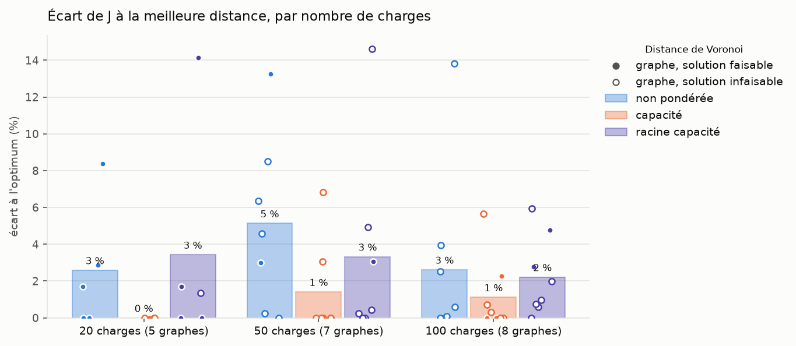
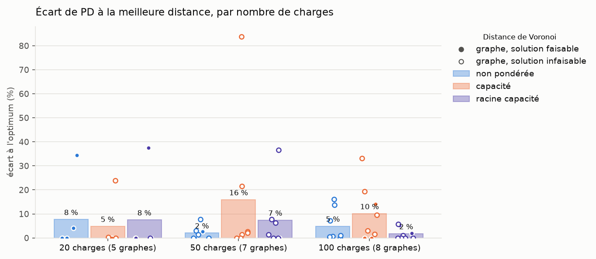
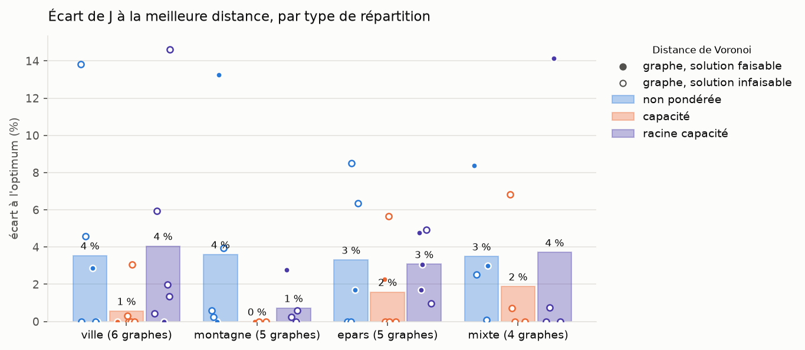
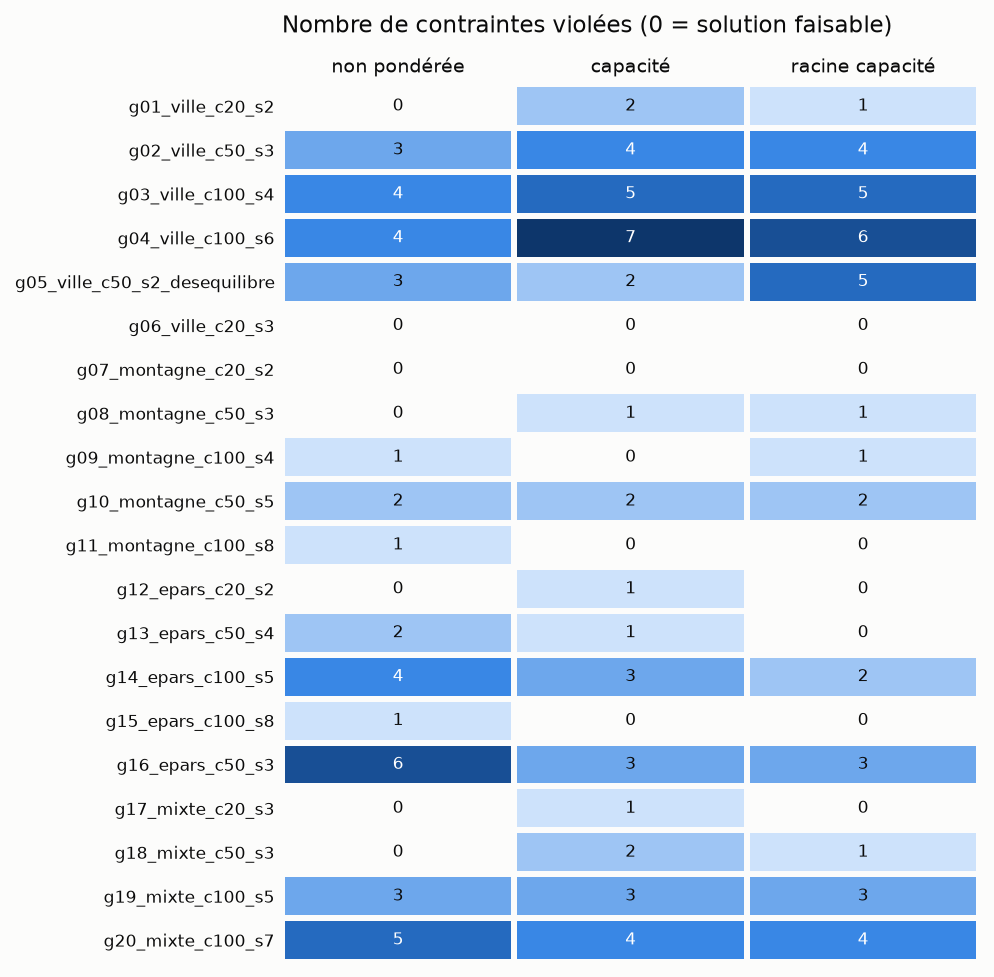

# Récapitulatif du run 20261004_122632

Objectif minimisé : J = L_tot, longueur totale des arbres (km), comme dans data/exemple_ete_4_PS/model.lp. Les contraintes (L_max et P_max par départ, capacité des sources, nombre de départs) sont strictes : elles sont seulement vérifiées, une solution qui en viole une est infaisable.

PD = Σ sur les arêtes des arbres de |puissance transitée| × longueur (MW·km), non inclus dans J.

Lecture : OK contrainte satisfaite partout, KO (violées/testées) sinon ; J en vert si la solution est faisable, en rouge sinon, en gras pour la plus courte solution faisable du graphe ; PD : <b>valeur</b> = plus petit PD des 3 distances ; distances : <b>non pondérée</b>, <b>capacité</b>, <b>racine capacité</b>.

## Détail par graphe et par distance

| Graphe | Type | Charges (dont <0) | Sources | Distance | J = L_tot (km) | PD (MW·km) | L_max départ | P_max départ | P_max source | Nb départs | Faisable |
|---|---|---|---|---|---|---|---|---|---|---|---|
| **g01_ville_c20_s2** | ville | 20 (5) | 2 | <b>non pondérée</b> | <b>29.7</b> | 79.9 | OK | OK | OK | OK | <b>oui</b> |
|  |  |  |  | <b>capacité</b> | 28.8 | 95.0 | KO (1/3) | KO (1/3) | OK | OK | <b>non</b> |
|  |  |  |  | <b>racine capacité</b> | 29.2 | <b>76.7</b> | OK | OK | KO (1/2) | OK | <b>non</b> |
| **g02_ville_c50_s3** | ville | 50 (10) | 3 | <b>non pondérée</b> | 74.8 | 240.1 | OK | KO (2/5) | KO (1/3) | OK | <b>non</b> |
|  |  |  |  | <b>capacité</b> | 71.5 | 236.3 | KO (1/4) | KO (2/4) | KO (1/3) | OK | <b>non</b> |
|  |  |  |  | <b>racine capacité</b> | 71.8 | <b>233.2</b> | KO (1/5) | KO (2/5) | KO (1/3) | OK | <b>non</b> |
| **g03_ville_c100_s4** | ville | 100 (12) | 4 | <b>non pondérée</b> | 119.5 | 428.1 | OK | KO (3/8) | KO (1/4) | OK | <b>non</b> |
|  |  |  |  | <b>capacité</b> | 119.8 | 438.0 | OK | KO (3/7) | KO (2/4) | OK | <b>non</b> |
|  |  |  |  | <b>racine capacité</b> | 121.8 | <b>425.1</b> | KO (1/8) | KO (3/8) | KO (1/4) | OK | <b>non</b> |
| **g04_ville_c100_s6** | ville | 100 (10) | 6 | <b>non pondérée</b> | 161.3 | <b>423.1</b> | OK | KO (3/12) | KO (1/6) | OK | <b>non</b> |
|  |  |  |  | <b>capacité</b> | 141.7 | 463.7 | KO (1/6) | KO (4/6) | KO (2/6) | OK | <b>non</b> |
|  |  |  |  | <b>racine capacité</b> | 150.1 | 447.6 | OK | KO (4/9) | KO (2/6) | OK | <b>non</b> |
| **g05_ville_c50_s2_desequilibre** | ville | 50 (8) | 2 | <b>non pondérée</b> | 68.1 | <b>269.9</b> | KO (1/3) | KO (1/3) | KO (1/2) | OK | <b>non</b> |
|  |  |  |  | <b>capacité</b> | 70.2 | 496.2 | KO (1/3) | KO (1/3) | OK | OK | <b>non</b> |
|  |  |  |  | <b>racine capacité</b> | 78.1 | 368.6 | KO (2/3) | KO (2/3) | KO (1/2) | OK | <b>non</b> |
| **g06_ville_c20_s3** | ville | 20 (6) | 3 | <b>non pondérée</b> | <b>22.6</b> | <b>34.5</b> | OK | OK | OK | OK | <b>oui</b> |
|  |  |  |  | <b>capacité</b> | 22.6 | 34.5 | OK | OK | OK | OK | <b>oui</b> |
|  |  |  |  | <b>racine capacité</b> | 22.6 | 34.5 | OK | OK | OK | OK | <b>oui</b> |
| **g07_montagne_c20_s2** | montagne | 20 (5) | 2 | <b>non pondérée</b> | <b>44.6</b> | <b>65.3</b> | OK | OK | OK | OK | <b>oui</b> |
|  |  |  |  | <b>capacité</b> | 44.6 | 65.3 | OK | OK | OK | OK | <b>oui</b> |
|  |  |  |  | <b>racine capacité</b> | 44.6 | 65.3 | OK | OK | OK | OK | <b>oui</b> |
| **g08_montagne_c50_s3** | montagne | 50 (10) | 3 | <b>non pondérée</b> | <b>122.5</b> | 302.9 | OK | OK | OK | OK | <b>oui</b> |
|  |  |  |  | <b>capacité</b> | 108.1 | <b>295.1</b> | KO (1/5) | OK | OK | OK | <b>non</b> |
|  |  |  |  | <b>racine capacité</b> | 108.1 | 295.1 | KO (1/5) | OK | OK | OK | <b>non</b> |
| **g09_montagne_c100_s4** | montagne | 100 (12) | 4 | <b>non pondérée</b> | 222.8 | 197.6 | KO (1/9) | OK | OK | OK | <b>non</b> |
|  |  |  |  | <b>capacité</b> | <b>221.5</b> | <b>195.5</b> | OK | OK | OK | OK | <b>oui</b> |
|  |  |  |  | <b>racine capacité</b> | 222.8 | 197.6 | KO (1/9) | OK | OK | OK | <b>non</b> |
| **g10_montagne_c50_s5** | montagne | 50 (9) | 5 | <b>non pondérée</b> | 134.2 | 103.5 | KO (1/10) | OK | KO (1/5) | OK | <b>non</b> |
|  |  |  |  | <b>capacité</b> | 133.9 | <b>102.1</b> | KO (1/10) | OK | KO (1/5) | OK | <b>non</b> |
|  |  |  |  | <b>racine capacité</b> | 134.2 | 103.5 | KO (1/10) | OK | KO (1/5) | OK | <b>non</b> |
| **g11_montagne_c100_s8** | montagne | 100 (11) | 8 | <b>non pondérée</b> | 216.7 | 238.9 | OK | KO (1/17) | OK | OK | <b>non</b> |
|  |  |  |  | <b>capacité</b> | <b>208.5</b> | <b>222.8</b> | OK | OK | OK | OK | <b>oui</b> |
|  |  |  |  | <b>racine capacité</b> | 214.3 | 234.5 | OK | OK | OK | OK | <b>oui</b> |
| **g12_epars_c20_s2** | epars | 20 (6) | 2 | <b>non pondérée</b> | <b>135.6</b> | <b>81.7</b> | OK | OK | OK | OK | <b>oui</b> |
|  |  |  |  | <b>capacité</b> | 133.4 | 81.9 | KO (1/4) | OK | OK | OK | <b>non</b> |
|  |  |  |  | <b>racine capacité</b> | 135.6 | 81.7 | OK | OK | OK | OK | <b>oui</b> |
| **g13_epars_c50_s4** | epars | 50 (10) | 4 | <b>non pondérée</b> | 392.5 | 398.7 | KO (1/12) | OK | KO (1/4) | OK | <b>non</b> |
|  |  |  |  | <b>capacité</b> | 361.7 | 380.1 | KO (1/10) | OK | OK | OK | <b>non</b> |
|  |  |  |  | <b>racine capacité</b> | <b>372.7</b> | <b>370.3</b> | OK | OK | OK | OK | <b>oui</b> |
| **g14_epars_c100_s5** | epars | 100 (12) | 5 | <b>non pondérée</b> | 662.3 | 741.9 | KO (1/12) | KO (1/12) | KO (2/5) | OK | <b>non</b> |
|  |  |  |  | <b>capacité</b> | 699.9 | 851.5 | KO (2/12) | KO (1/12) | OK | OK | <b>non</b> |
|  |  |  |  | <b>racine capacité</b> | 668.7 | <b>639.5</b> | KO (1/12) | OK | KO (1/5) | OK | <b>non</b> |
| **g15_epars_c100_s8** | epars | 100 (10) | 8 | <b>non pondérée</b> | 701.5 | <b>586.6</b> | KO (1/16) | OK | OK | OK | <b>non</b> |
|  |  |  |  | <b>capacité</b> | <b>717.4</b> | 669.4 | OK | OK | OK | OK | <b>oui</b> |
|  |  |  |  | <b>racine capacité</b> | 734.9 | 597.9 | OK | OK | OK | OK | <b>oui</b> |
| **g16_epars_c50_s3** | epars | 50 (9) | 3 | <b>non pondérée</b> | 433.0 | <b>468.6</b> | KO (1/5) | KO (3/5) | KO (2/3) | OK | <b>non</b> |
|  |  |  |  | <b>capacité</b> | 407.2 | 478.3 | KO (1/4) | KO (1/4) | KO (1/3) | OK | <b>non</b> |
|  |  |  |  | <b>racine capacité</b> | 427.2 | 497.7 | KO (1/5) | KO (1/5) | KO (1/3) | OK | <b>non</b> |
| **g17_mixte_c20_s3** | mixte | 20 (6) | 3 | <b>non pondérée</b> | <b>97.5</b> | 113.5 | OK | OK | OK | OK | <b>oui</b> |
|  |  |  |  | <b>capacité</b> | 90.0 | <b>84.5</b> | KO (1/2) | OK | OK | OK | <b>non</b> |
|  |  |  |  | <b>racine capacité</b> | 102.7 | 116.2 | OK | OK | OK | OK | <b>oui</b> |
| **g18_mixte_c50_s3** | mixte | 50 (10) | 3 | <b>non pondérée</b> | <b>289.1</b> | <b>396.1</b> | OK | OK | OK | OK | <b>oui</b> |
|  |  |  |  | <b>capacité</b> | 299.9 | 481.1 | KO (1/8) | OK | OK | KO (1/3) | <b>non</b> |
|  |  |  |  | <b>racine capacité</b> | 280.7 | 426.6 | KO (1/7) | OK | OK | OK | <b>non</b> |
| **g19_mixte_c100_s5** | mixte | 100 (12) | 5 | <b>non pondérée</b> | 423.1 | 507.4 | KO (2/13) | KO (1/13) | OK | OK | <b>non</b> |
|  |  |  |  | <b>capacité</b> | 422.7 | 452.8 | KO (2/11) | KO (1/11) | OK | OK | <b>non</b> |
|  |  |  |  | <b>racine capacité</b> | 425.8 | <b>445.8</b> | KO (2/12) | KO (1/12) | OK | OK | <b>non</b> |
| **g20_mixte_c100_s7** | mixte | 100 (11) | 7 | <b>non pondérée</b> | 455.9 | 544.2 | KO (2/14) | KO (1/14) | KO (2/7) | OK | <b>non</b> |
|  |  |  |  | <b>capacité</b> | 447.9 | 647.0 | KO (2/13) | KO (1/13) | KO (1/7) | OK | <b>non</b> |
|  |  |  |  | <b>racine capacité</b> | 444.7 | <b>541.9</b> | KO (2/14) | KO (1/14) | KO (1/7) | OK | <b>non</b> |

## Fonction objectif J = L_tot (km) et produit PD (MW·km) par distance

J : vert si toutes les contraintes sont satisfaites, rouge sinon. En gras : plus courte solution faisable (J) / plus petit PD des 3 distances. Meilleur J = plus courte solution faisable.

| Graphe | J <b>non pondérée</b> | J <b>capacité</b> | J <b>racine capacité</b> | PD <b>non pondérée</b> | PD <b>capacité</b> | PD <b>racine capacité</b> | Meilleur J | Meilleur PD |
|---|---|---|---|---|---|---|---|---|
| g01_ville_c20_s2 | <b>29.7</b> | 28.8 | 29.2 | 79.9 | 95.0 | **76.7** | <b>non pondérée</b> | <b>racine capacité</b> |
| g02_ville_c50_s3 | 74.8 | 71.5 | 71.8 | 240.1 | 236.3 | **233.2** | aucune | <b>racine capacité</b> |
| g03_ville_c100_s4 | 119.5 | 119.8 | 121.8 | 428.1 | 438.0 | **425.1** | aucune | <b>racine capacité</b> |
| g04_ville_c100_s6 | 161.3 | 141.7 | 150.1 | **423.1** | 463.7 | 447.6 | aucune | <b>non pondérée</b> |
| g05_ville_c50_s2_desequilibre | 68.1 | 70.2 | 78.1 | **269.9** | 496.2 | 368.6 | aucune | <b>non pondérée</b> |
| g06_ville_c20_s3 | <b>22.6</b> | 22.6 | 22.6 | **34.5** | 34.5 | 34.5 | <b>non pondérée</b> | <b>non pondérée</b> |
| g07_montagne_c20_s2 | <b>44.6</b> | 44.6 | 44.6 | **65.3** | 65.3 | 65.3 | <b>non pondérée</b> | <b>non pondérée</b> |
| g08_montagne_c50_s3 | <b>122.5</b> | 108.1 | 108.1 | 302.9 | **295.1** | 295.1 | <b>non pondérée</b> | <b>capacité</b> |
| g09_montagne_c100_s4 | 222.8 | <b>221.5</b> | 222.8 | 197.6 | **195.5** | 197.6 | <b>capacité</b> | <b>capacité</b> |
| g10_montagne_c50_s5 | 134.2 | 133.9 | 134.2 | 103.5 | **102.1** | 103.5 | aucune | <b>capacité</b> |
| g11_montagne_c100_s8 | 216.7 | <b>208.5</b> | 214.3 | 238.9 | **222.8** | 234.5 | <b>capacité</b> | <b>capacité</b> |
| g12_epars_c20_s2 | <b>135.6</b> | 133.4 | 135.6 | **81.7** | 81.9 | 81.7 | <b>non pondérée</b> | <b>non pondérée</b> |
| g13_epars_c50_s4 | 392.5 | 361.7 | <b>372.7</b> | 398.7 | 380.1 | **370.3** | <b>racine capacité</b> | <b>racine capacité</b> |
| g14_epars_c100_s5 | 662.3 | 699.9 | 668.7 | 741.9 | 851.5 | **639.5** | aucune | <b>racine capacité</b> |
| g15_epars_c100_s8 | 701.5 | <b>717.4</b> | 734.9 | **586.6** | 669.4 | 597.9 | <b>capacité</b> | <b>non pondérée</b> |
| g16_epars_c50_s3 | 433.0 | 407.2 | 427.2 | **468.6** | 478.3 | 497.7 | aucune | <b>non pondérée</b> |
| g17_mixte_c20_s3 | <b>97.5</b> | 90.0 | 102.7 | 113.5 | **84.5** | 116.2 | <b>non pondérée</b> | <b>capacité</b> |
| g18_mixte_c50_s3 | <b>289.1</b> | 299.9 | 280.7 | **396.1** | 481.1 | 426.6 | <b>non pondérée</b> | <b>non pondérée</b> |
| g19_mixte_c100_s5 | 423.1 | 422.7 | 425.8 | 507.4 | 452.8 | **445.8** | aucune | <b>racine capacité</b> |
| g20_mixte_c100_s7 | 455.9 | 447.9 | 444.7 | 544.2 | 647.0 | **541.9** | aucune | <b>racine capacité</b> |

## Synthèse

| Distance | Meilleur J faisable (nb graphes) | Meilleur PD (nb graphes) | Runs faisables | J moyen (km) | PD moyen (MW·km) |
|---|---|---|---|---|---|
| <b>non pondérée</b> | 7 | 8 | 7/20 | 240.4 | 311.1 |
| <b>capacité</b> | 3 | 5 | 5/20 | 237.6 | 338.6 |
| <b>racine capacité</b> | 1 | 7 | 7/20 | 239.5 | 310.0 |

## Graphiques

### Écart relatif à l'optimum de J, par nombre de charges

J = L_tot. Pour chaque graphe, l'optimum est la plus petite valeur des 3 distances (0 %), faisable ou non. Barres : écart moyen ; points : un graphe (creux si la solution viole une contrainte).

### Écart relatif à l'optimum de PD, par nombre de charges

Même lecture, pour le produit PD (puissance × distance).

### Écart relatif à l'optimum de J, par type de répartition

Quelle distance convient à quelle répartition des charges.

### Contraintes violées

Nombre total de contraintes violées (L_max, P_max départ, P_max source, nb départs) pour chaque graphe et chaque distance.

