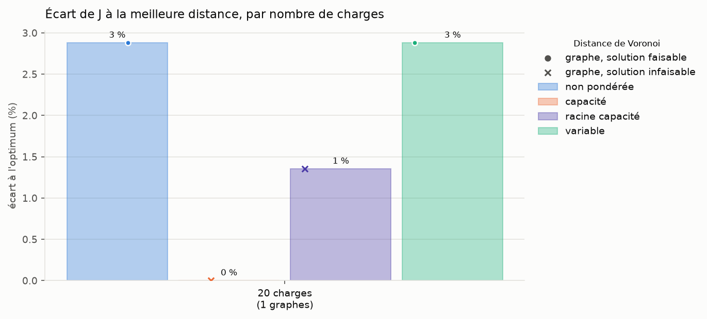
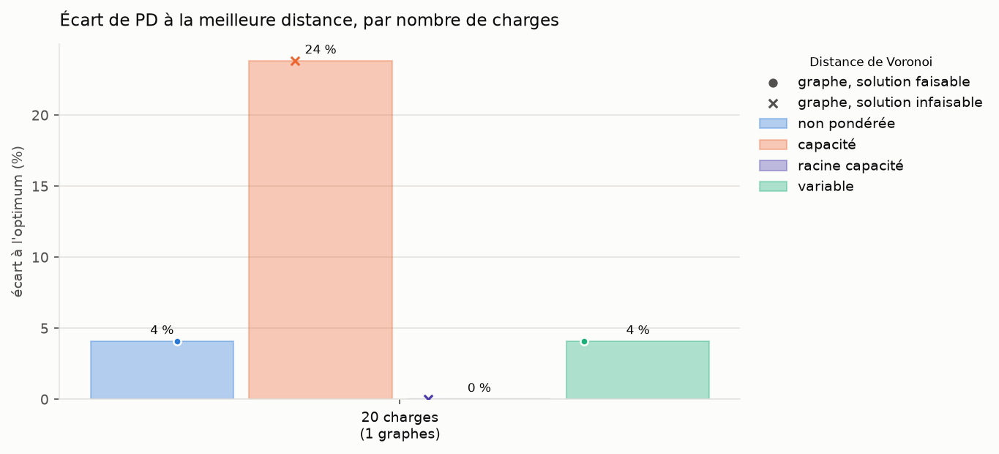
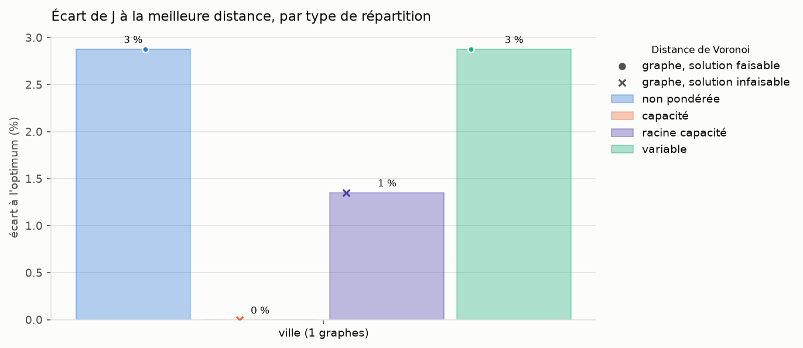
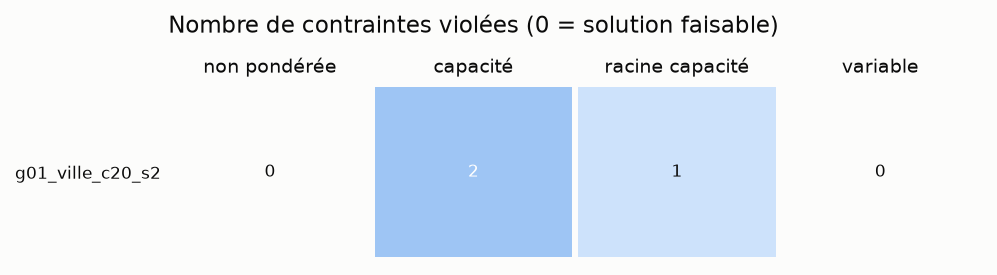

# Récapitulatif du run 20261004_152826_test

Objectif minimisé : J = L_tot, longueur totale des arbres (km), comme dans data/exemple_ete_4_PS/model.lp. Les contraintes (L_max et P_max par départ, capacité des sources, nombre de départs) ne sont pas dans J : elles sont seulement vérifiées. Toutes les solutions sont comparées, même celles qui violent une contrainte (infaisables : en rouge dans les tableaux, croix sur les graphiques).

PD = Σ sur les arêtes des arbres de |puissance transitée| × longueur (MW·km), non inclus dans J.

Lecture : OK contrainte satisfaite partout, KO (violées/testées) sinon ; J en vert si la solution est faisable, en rouge sinon, en gras pour la plus courte solution du graphe (faisable ou non) ; PD : <b>valeur</b> = plus petit PD des 4 distances ; distances : <b>non pondérée</b>, <b>capacité</b>, <b>racine capacité</b>, <b>variable</b>.

## Détail par graphe et par distance

| Graphe | Type | Charges (dont <0) | Sources | Distance | J = L_tot (km) | PD (MW·km) | L_max départ | P_max départ | P_max source | Nb départs | Faisable |
|---|---|---|---|---|---|---|---|---|---|---|---|
| **g01_ville_c20_s2** | ville | 20 (5) | 2 | <b>non pondérée</b> | 29.7 | 79.9 | OK | OK | OK | OK | <b>oui</b> |
|  |  |  |  | <b>capacité</b> | <b>28.8</b> | 95.0 | KO (1/3) | KO (1/3) | OK | OK | <b>non</b> |
|  |  |  |  | <b>racine capacité</b> | 29.2 | <b>76.7</b> | OK | OK | KO (1/2) | OK | <b>non</b> |
|  |  |  |  | <b>variable</b> | 29.7 | 79.9 | OK | OK | OK | OK | <b>oui</b> |

## Fonction objectif J = L_tot (km) et produit PD (MW·km) par distance

J : vert si toutes les contraintes sont satisfaites, rouge sinon. En gras : plus petite valeur des 4 distances, solutions faisables ou non.

| Graphe | J <b>non pondérée</b> | J <b>capacité</b> | J <b>racine capacité</b> | J <b>variable</b> | PD <b>non pondérée</b> | PD <b>capacité</b> | PD <b>racine capacité</b> | PD <b>variable</b> | Meilleur J | Meilleur PD |
|---|---|---|---|---|---|---|---|---|---|---|
| g01_ville_c20_s2 | 29.7 | <b>28.8</b> | 29.2 | 29.7 | 79.9 | 95.0 | **76.7** | 79.9 | <b>capacité</b> | <b>racine capacité</b> |

## Synthèse

Écart à l'optimum : 100 × (X − X_min) / X_min, X_min = plus petite valeur des 4 distances sur le graphe ; moyenne sur les graphes (comparable entre graphes de tailles différentes, contrairement aux moyennes de J et PD).

| Distance | Meilleur J (nb graphes) | Meilleur PD (nb graphes) | Runs faisables | Écart moyen J (%) | Écart moyen PD (%) | J moyen (km) | PD moyen (MW·km) |
|---|---|---|---|---|---|---|---|
| <b>non pondérée</b> | 0 | 0 | 1/1 | 2.9 | 4.1 | 29.7 | 79.9 |
| <b>capacité</b> | 1 | 0 | 0/1 | 0.0 | 23.8 | 28.8 | 95.0 |
| <b>racine capacité</b> | 0 | 1 | 0/1 | 1.4 | 0.0 | 29.2 | 76.7 |
| <b>variable</b> | 0 | 0 | 1/1 | 2.9 | 4.1 | 29.7 | 79.9 |

## Synthèse par nombre de charges

Par groupe de graphes de même nombre de charges : runs faisables, nombre de graphes où la distance donne le plus petit J, écart moyen de J à l'optimum.

| Charges | Graphes | Faisables <b>non pondérée</b> | Faisables <b>capacité</b> | Faisables <b>racine capacité</b> | Faisables <b>variable</b> | Meilleur J <b>non pondérée</b> | Meilleur J <b>capacité</b> | Meilleur J <b>racine capacité</b> | Meilleur J <b>variable</b> | Écart J (%) <b>non pondérée</b> | Écart J (%) <b>capacité</b> | Écart J (%) <b>racine capacité</b> | Écart J (%) <b>variable</b> |
|---|---|---|---|---|---|---|---|---|---|---|---|---|---|
| 20 | 1 | 1/1 | 0/1 | 0/1 | 1/1 | 0 | 1 | 0 | 0 | 2.9 | 0.0 | 1.4 | 2.9 |

## Graphiques

### Écart relatif à l'optimum de J, par nombre de charges

J = L_tot. Pour chaque graphe, l'optimum est la plus petite valeur des 4 distances (0 %), faisable ou non. Barres : écart moyen ; un marqueur par graphe : rond si la solution respecte les contraintes, croix sinon.

### Écart relatif à l'optimum de PD, par nombre de charges

Même lecture, pour le produit PD (puissance × distance).

### Écart relatif à l'optimum de J, par type de répartition

Quelle distance convient à quelle répartition des charges.

### Contraintes violées

Nombre total de contraintes violées (L_max, P_max départ, P_max source, nb départs, erreurs de structure) pour chaque graphe et chaque méthode.

