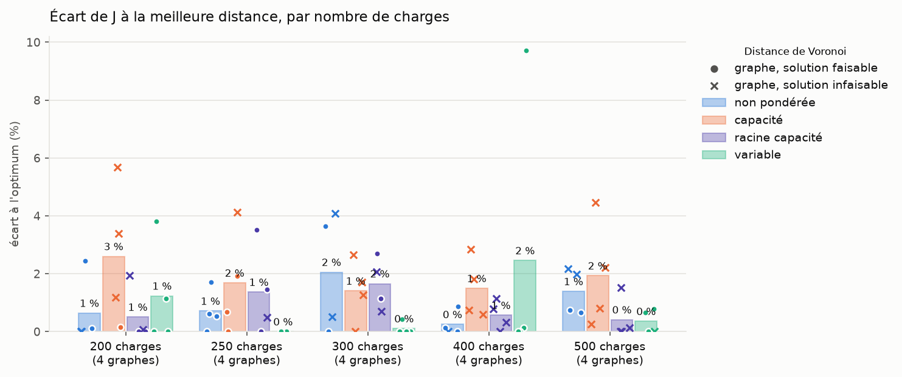
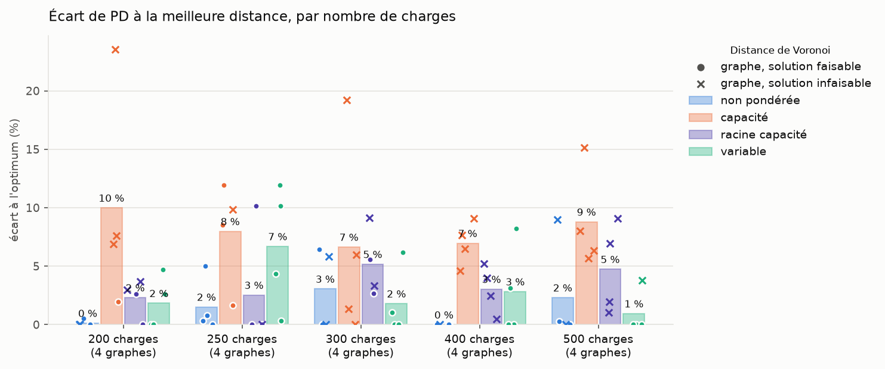
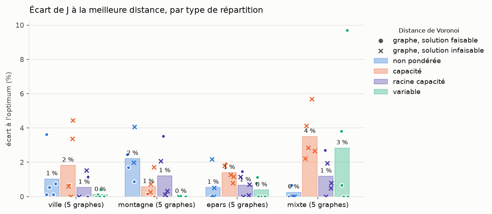
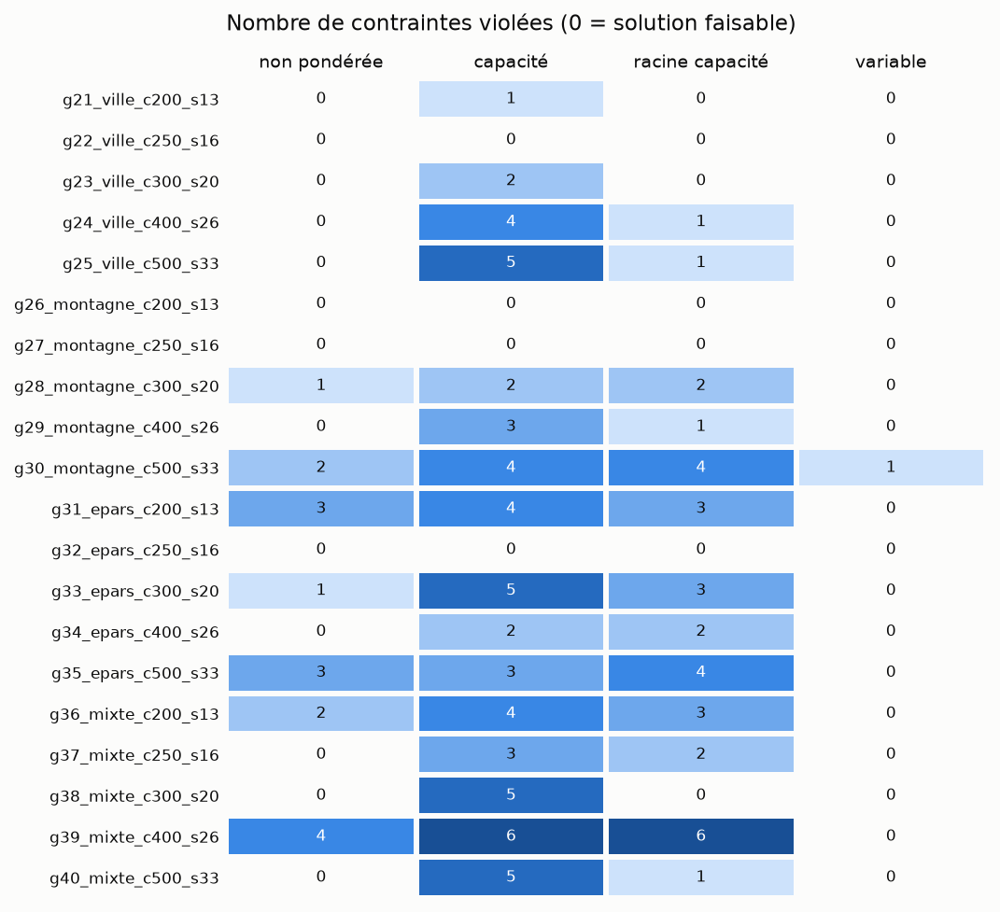

# Récapitulatif du run 20261004_215518_grandes_variable

Objectif minimisé : J = L_tot, longueur totale des arbres (km), comme dans data/exemple_ete_4_PS/model.lp. Les contraintes (L_max et P_max par départ, capacité des sources, nombre de départs) ne sont pas dans J : elles sont seulement vérifiées. Toutes les solutions sont comparées, même celles qui violent une contrainte (infaisables : en rouge dans les tableaux, croix sur les graphiques).

PD = Σ sur les arêtes des arbres de |puissance transitée| × longueur (MW·km), non inclus dans J.

Lecture : OK contrainte satisfaite partout, KO (violées/testées) sinon ; J en vert si la solution est faisable, en rouge sinon, en gras pour la plus courte solution du graphe (faisable ou non) ; PD : <b>valeur</b> = plus petit PD des 4 distances ; distances : <b>non pondérée</b>, <b>capacité</b>, <b>racine capacité</b>, <b>variable</b>.

## Détail par graphe et par distance

| Graphe | Type | Charges (dont <0) | Sources | Distance | J = L_tot (km) | PD (MW·km) | L_max départ | P_max départ | P_max source | Nb départs | Faisable |
|---|---|---|---|---|---|---|---|---|---|---|---|
| **g21_ville_c200_s13** | ville | 200 (20) | 13 | <b>non pondérée</b> | 208.8 | <b>482.9</b> | OK | OK | OK | OK | <b>oui</b> |
|  |  |  |  | <b>capacité</b> | 215.6 | 519.7 | OK | KO (1/33) | OK | OK | <b>non</b> |
|  |  |  |  | <b>racine capacité</b> | <b>208.6</b> | 495.5 | OK | OK | OK | OK | <b>oui</b> |
|  |  |  |  | <b>variable</b> | 208.6 | 495.5 | OK | OK | OK | OK | <b>oui</b> |
| **g22_ville_c250_s16** | ville | 250 (25) | 16 | <b>non pondérée</b> | 267.3 | <b>619.1</b> | OK | OK | OK | OK | <b>oui</b> |
|  |  |  |  | <b>capacité</b> | 267.7 | 671.8 | OK | OK | OK | OK | <b>oui</b> |
|  |  |  |  | <b>racine capacité</b> | <b>265.9</b> | 682.0 | OK | OK | OK | OK | <b>oui</b> |
|  |  |  |  | <b>variable</b> | 265.9 | 682.0 | OK | OK | OK | OK | <b>oui</b> |
| **g23_ville_c300_s20** | ville | 300 (30) | 20 | <b>non pondérée</b> | 345.9 | 946.2 | OK | OK | OK | OK | <b>oui</b> |
|  |  |  |  | <b>capacité</b> | <b>333.7</b> | 900.9 | OK | KO (2/43) | OK | OK | <b>non</b> |
|  |  |  |  | <b>racine capacité</b> | 337.5 | 912.5 | OK | OK | OK | OK | <b>oui</b> |
|  |  |  |  | <b>variable</b> | 335.1 | <b>888.9</b> | OK | OK | OK | OK | <b>oui</b> |
| **g24_ville_c400_s26** | ville | 400 (40) | 26 | <b>non pondérée</b> | 456.1 | <b>1090.2</b> | OK | OK | OK | OK | <b>oui</b> |
|  |  |  |  | <b>capacité</b> | 458.3 | 1189.2 | OK | KO (2/66) | KO (2/26) | OK | <b>non</b> |
|  |  |  |  | <b>racine capacité</b> | <b>455.5</b> | 1116.8 | OK | KO (1/66) | OK | OK | <b>non</b> |
|  |  |  |  | <b>variable</b> | 456.1 | 1090.2 | OK | OK | OK | OK | <b>oui</b> |
| **g25_ville_c500_s33** | ville | 500 (50) | 33 | <b>non pondérée</b> | 578.2 | 1468.0 | OK | OK | OK | OK | <b>oui</b> |
|  |  |  |  | <b>capacité</b> | 599.5 | 1685.8 | KO (1/80) | KO (2/80) | KO (2/33) | OK | <b>non</b> |
|  |  |  |  | <b>racine capacité</b> | 582.6 | 1492.5 | OK | KO (1/80) | OK | OK | <b>non</b> |
|  |  |  |  | <b>variable</b> | <b>573.9</b> | <b>1464.2</b> | OK | OK | OK | OK | <b>oui</b> |
| **g26_montagne_c200_s13** | montagne | 200 (22) | 13 | <b>non pondérée</b> | 335.8 | 312.3 | OK | OK | OK | OK | <b>oui</b> |
|  |  |  |  | <b>capacité</b> | 328.3 | 316.7 | OK | OK | OK | OK | <b>oui</b> |
|  |  |  |  | <b>racine capacité</b> | <b>327.8</b> | <b>310.6</b> | OK | OK | OK | OK | <b>oui</b> |
|  |  |  |  | <b>variable</b> | 327.8 | 310.6 | OK | OK | OK | OK | <b>oui</b> |
| **g27_montagne_c250_s16** | montagne | 250 (28) | 16 | <b>non pondérée</b> | 396.5 | 485.6 | OK | OK | OK | OK | <b>oui</b> |
|  |  |  |  | <b>capacité</b> | <b>389.8</b> | 539.5 | OK | OK | OK | OK | <b>oui</b> |
|  |  |  |  | <b>racine capacité</b> | 403.5 | <b>481.9</b> | OK | OK | OK | OK | <b>oui</b> |
|  |  |  |  | <b>variable</b> | 389.8 | 539.5 | OK | OK | OK | OK | <b>oui</b> |
| **g28_montagne_c300_s20** | montagne | 300 (33) | 20 | <b>non pondérée</b> | 464.5 | 598.1 | OK | OK | KO (1/20) | OK | <b>non</b> |
|  |  |  |  | <b>capacité</b> | 454.0 | <b>565.2</b> | OK | OK | KO (2/20) | OK | <b>non</b> |
|  |  |  |  | <b>racine capacité</b> | 455.6 | 616.9 | OK | OK | KO (2/20) | OK | <b>non</b> |
|  |  |  |  | <b>variable</b> | <b>446.3</b> | 600.1 | OK | OK | OK | OK | <b>oui</b> |
| **g29_montagne_c400_s26** | montagne | 400 (44) | 26 | <b>non pondérée</b> | 644.5 | <b>752.8</b> | OK | OK | OK | OK | <b>oui</b> |
|  |  |  |  | <b>capacité</b> | 643.6 | 787.6 | KO (2/44) | OK | KO (1/26) | OK | <b>non</b> |
|  |  |  |  | <b>racine capacité</b> | 640.9 | 756.5 | KO (1/43) | OK | OK | OK | <b>non</b> |
|  |  |  |  | <b>variable</b> | <b>638.9</b> | 776.2 | OK | OK | OK | OK | <b>oui</b> |
| **g30_montagne_c500_s33** | montagne | 500 (55) | 33 | <b>non pondérée</b> | 842.9 | <b>1010.7</b> | KO (1/66) | OK | OK | KO (1/33) | <b>non</b> |
|  |  |  |  | <b>capacité</b> | 828.6 | 1091.8 | KO (1/61) | KO (1/61) | KO (2/33) | OK | <b>non</b> |
|  |  |  |  | <b>racine capacité</b> | 827.5 | 1102.4 | KO (1/62) | KO (1/62) | KO (2/33) | OK | <b>non</b> |
|  |  |  |  | <b>variable</b> | <b>826.4</b> | 1049.2 | KO (1/62) | OK | OK | OK | <b>non</b> |
| **g31_epars_c200_s13** | epars | 200 (20) | 13 | <b>non pondérée</b> | <b>1383.6</b> | <b>1214.6</b> | KO (2/31) | KO (1/31) | OK | OK | <b>non</b> |
|  |  |  |  | <b>capacité</b> | 1399.9 | 1298.1 | KO (3/31) | OK | KO (1/13) | OK | <b>non</b> |
|  |  |  |  | <b>racine capacité</b> | 1384.5 | 1259.2 | KO (2/31) | KO (1/31) | OK | OK | <b>non</b> |
|  |  |  |  | <b>variable</b> | 1399.3 | 1271.9 | OK | OK | OK | OK | <b>oui</b> |
| **g32_epars_c250_s16** | epars | 250 (25) | 16 | <b>non pondérée</b> | <b>1671.9</b> | 1371.8 | OK | OK | OK | OK | <b>oui</b> |
|  |  |  |  | <b>capacité</b> | 1704.1 | 1389.6 | OK | OK | OK | OK | <b>oui</b> |
|  |  |  |  | <b>racine capacité</b> | 1696.2 | <b>1367.3</b> | OK | OK | OK | OK | <b>oui</b> |
|  |  |  |  | <b>variable</b> | 1671.9 | 1371.8 | OK | OK | OK | OK | <b>oui</b> |
| **g33_epars_c300_s20** | epars | 300 (30) | 20 | <b>non pondérée</b> | 2025.1 | <b>1631.1</b> | OK | KO (1/53) | OK | OK | <b>non</b> |
|  |  |  |  | <b>capacité</b> | 2040.3 | 1729.0 | KO (3/53) | KO (2/53) | OK | OK | <b>non</b> |
|  |  |  |  | <b>racine capacité</b> | 2029.1 | 1685.1 | KO (2/53) | KO (1/53) | OK | OK | <b>non</b> |
|  |  |  |  | <b>variable</b> | <b>2014.8</b> | 1647.9 | OK | OK | OK | OK | <b>oui</b> |
| **g34_epars_c400_s26** | epars | 400 (40) | 26 | <b>non pondérée</b> | <b>2587.7</b> | <b>2051.9</b> | OK | OK | OK | OK | <b>oui</b> |
|  |  |  |  | <b>capacité</b> | 2634.4 | 2185.0 | KO (1/62) | KO (1/62) | OK | OK | <b>non</b> |
|  |  |  |  | <b>racine capacité</b> | 2617.4 | 2133.9 | OK | KO (1/62) | KO (1/26) | OK | <b>non</b> |
|  |  |  |  | <b>variable</b> | 2587.7 | 2051.9 | OK | OK | OK | OK | <b>oui</b> |
| **g35_epars_c500_s33** | epars | 500 (50) | 33 | <b>non pondérée</b> | 3284.1 | 2999.3 | KO (1/73) | KO (2/73) | OK | OK | <b>non</b> |
|  |  |  |  | <b>capacité</b> | 3240.1 | 2907.8 | KO (2/72) | KO (1/72) | OK | OK | <b>non</b> |
|  |  |  |  | <b>racine capacité</b> | <b>3214.4</b> | 2942.7 | KO (2/74) | KO (2/74) | OK | OK | <b>non</b> |
|  |  |  |  | <b>variable</b> | 3239.3 | <b>2751.6</b> | OK | OK | OK | OK | <b>oui</b> |
| **g36_mixte_c200_s13** | mixte | 200 (22) | 13 | <b>non pondérée</b> | <b>834.0</b> | <b>1145.5</b> | KO (1/30) | KO (1/30) | OK | OK | <b>non</b> |
|  |  |  |  | <b>capacité</b> | 881.4 | 1414.9 | KO (2/27) | KO (2/27) | OK | OK | <b>non</b> |
|  |  |  |  | <b>racine capacité</b> | 850.3 | 1179.8 | KO (2/31) | KO (1/31) | OK | OK | <b>non</b> |
|  |  |  |  | <b>variable</b> | 865.8 | 1145.7 | OK | OK | OK | OK | <b>oui</b> |
| **g37_mixte_c250_s16** | mixte | 250 (28) | 16 | <b>non pondérée</b> | 982.8 | 1228.0 | OK | OK | OK | OK | <b>oui</b> |
|  |  |  |  | <b>capacité</b> | 1017.2 | 1285.0 | KO (3/34) | OK | OK | OK | <b>non</b> |
|  |  |  |  | <b>racine capacité</b> | 981.6 | <b>1169.6</b> | KO (2/36) | OK | OK | OK | <b>non</b> |
|  |  |  |  | <b>variable</b> | <b>976.8</b> | 1220.6 | OK | OK | OK | OK | <b>oui</b> |
| **g38_mixte_c300_s20** | mixte | 300 (33) | 20 | <b>non pondérée</b> | <b>1082.5</b> | <b>1505.5</b> | OK | OK | OK | OK | <b>oui</b> |
|  |  |  |  | <b>capacité</b> | 1111.2 | 1795.0 | KO (3/46) | KO (1/46) | KO (1/20) | OK | <b>non</b> |
|  |  |  |  | <b>racine capacité</b> | 1111.8 | 1589.7 | OK | OK | OK | OK | <b>oui</b> |
|  |  |  |  | <b>variable</b> | 1082.5 | 1505.5 | OK | OK | OK | OK | <b>oui</b> |
| **g39_mixte_c400_s26** | mixte | 400 (44) | 26 | <b>non pondérée</b> | <b>1625.4</b> | <b>2306.5</b> | KO (2/64) | KO (2/64) | OK | OK | <b>non</b> |
|  |  |  |  | <b>capacité</b> | 1671.6 | 2483.5 | KO (3/60) | KO (2/60) | KO (1/26) | OK | <b>non</b> |
|  |  |  |  | <b>racine capacité</b> | 1638.3 | 2427.3 | KO (3/64) | KO (3/64) | OK | OK | <b>non</b> |
|  |  |  |  | <b>variable</b> | 1783.2 | 2496.2 | OK | OK | OK | OK | <b>oui</b> |
| **g40_mixte_c500_s33** | mixte | 500 (55) | 33 | <b>non pondérée</b> | 1912.5 | <b>2553.3</b> | OK | OK | OK | OK | <b>oui</b> |
|  |  |  |  | <b>capacité</b> | 1942.0 | 2715.6 | KO (4/80) | KO (1/80) | OK | OK | <b>non</b> |
|  |  |  |  | <b>racine capacité</b> | <b>1900.0</b> | 2580.1 | KO (1/81) | OK | OK | OK | <b>non</b> |
|  |  |  |  | <b>variable</b> | 1912.5 | 2553.3 | OK | OK | OK | OK | <b>oui</b> |

## Fonction objectif J = L_tot (km) et produit PD (MW·km) par distance

J : vert si toutes les contraintes sont satisfaites, rouge sinon. En gras : plus petite valeur des 4 distances, solutions faisables ou non.

| Graphe | J <b>non pondérée</b> | J <b>capacité</b> | J <b>racine capacité</b> | J <b>variable</b> | PD <b>non pondérée</b> | PD <b>capacité</b> | PD <b>racine capacité</b> | PD <b>variable</b> | Meilleur J | Meilleur PD |
|---|---|---|---|---|---|---|---|---|---|---|
| g21_ville_c200_s13 | 208.8 | 215.6 | <b>208.6</b> | 208.6 | **482.9** | 519.7 | 495.5 | 495.5 | <b>racine capacité</b> | <b>non pondérée</b> |
| g22_ville_c250_s16 | 267.3 | 267.7 | <b>265.9</b> | 265.9 | **619.1** | 671.8 | 682.0 | 682.0 | <b>racine capacité</b> | <b>non pondérée</b> |
| g23_ville_c300_s20 | 345.9 | <b>333.7</b> | 337.5 | 335.1 | 946.2 | 900.9 | 912.5 | **888.9** | <b>capacité</b> | <b>variable</b> |
| g24_ville_c400_s26 | 456.1 | 458.3 | <b>455.5</b> | 456.1 | **1090.2** | 1189.2 | 1116.8 | 1090.2 | <b>racine capacité</b> | <b>non pondérée</b> |
| g25_ville_c500_s33 | 578.2 | 599.5 | 582.6 | <b>573.9</b> | 1468.0 | 1685.8 | 1492.5 | **1464.2** | <b>variable</b> | <b>variable</b> |
| g26_montagne_c200_s13 | 335.8 | 328.3 | <b>327.8</b> | 327.8 | 312.3 | 316.7 | **310.6** | 310.6 | <b>racine capacité</b> | <b>racine capacité</b> |
| g27_montagne_c250_s16 | 396.5 | <b>389.8</b> | 403.5 | 389.8 | 485.6 | 539.5 | **481.9** | 539.5 | <b>capacité</b> | <b>racine capacité</b> |
| g28_montagne_c300_s20 | 464.5 | 454.0 | 455.6 | <b>446.3</b> | 598.1 | **565.2** | 616.9 | 600.1 | <b>variable</b> | <b>capacité</b> |
| g29_montagne_c400_s26 | 644.5 | 643.6 | 640.9 | <b>638.9</b> | **752.8** | 787.6 | 756.5 | 776.2 | <b>variable</b> | <b>non pondérée</b> |
| g30_montagne_c500_s33 | 842.9 | 828.6 | 827.5 | <b>826.4</b> | **1010.7** | 1091.8 | 1102.4 | 1049.2 | <b>variable</b> | <b>non pondérée</b> |
| g31_epars_c200_s13 | <b>1383.6</b> | 1399.9 | 1384.5 | 1399.3 | **1214.6** | 1298.1 | 1259.2 | 1271.9 | <b>non pondérée</b> | <b>non pondérée</b> |
| g32_epars_c250_s16 | <b>1671.9</b> | 1704.1 | 1696.2 | 1671.9 | 1371.8 | 1389.6 | **1367.3** | 1371.8 | <b>non pondérée</b> | <b>racine capacité</b> |
| g33_epars_c300_s20 | 2025.1 | 2040.3 | 2029.1 | <b>2014.8</b> | **1631.1** | 1729.0 | 1685.1 | 1647.9 | <b>variable</b> | <b>non pondérée</b> |
| g34_epars_c400_s26 | <b>2587.7</b> | 2634.4 | 2617.4 | 2587.7 | **2051.9** | 2185.0 | 2133.9 | 2051.9 | <b>non pondérée</b> | <b>non pondérée</b> |
| g35_epars_c500_s33 | 3284.1 | 3240.1 | <b>3214.4</b> | 3239.3 | 2999.3 | 2907.8 | 2942.7 | **2751.6** | <b>racine capacité</b> | <b>variable</b> |
| g36_mixte_c200_s13 | <b>834.0</b> | 881.4 | 850.3 | 865.8 | **1145.5** | 1414.9 | 1179.8 | 1145.7 | <b>non pondérée</b> | <b>non pondérée</b> |
| g37_mixte_c250_s16 | 982.8 | 1017.2 | 981.6 | <b>976.8</b> | 1228.0 | 1285.0 | **1169.6** | 1220.6 | <b>variable</b> | <b>racine capacité</b> |
| g38_mixte_c300_s20 | <b>1082.5</b> | 1111.2 | 1111.8 | 1082.5 | **1505.5** | 1795.0 | 1589.7 | 1505.5 | <b>non pondérée</b> | <b>non pondérée</b> |
| g39_mixte_c400_s26 | <b>1625.4</b> | 1671.6 | 1638.3 | 1783.2 | **2306.5** | 2483.5 | 2427.3 | 2496.2 | <b>non pondérée</b> | <b>non pondérée</b> |
| g40_mixte_c500_s33 | 1912.5 | 1942.0 | <b>1900.0</b> | 1912.5 | **2553.3** | 2715.6 | 2580.1 | 2553.3 | <b>racine capacité</b> | <b>non pondérée</b> |

## Synthèse

Écart à l'optimum : 100 × (X − X_min) / X_min, X_min = plus petite valeur des 4 distances sur le graphe ; moyenne sur les graphes (comparable entre graphes de tailles différentes, contrairement aux moyennes de J et PD).

| Distance | Meilleur J (nb graphes) | Meilleur PD (nb graphes) | Runs faisables | Écart moyen J (%) | Écart moyen PD (%) | J moyen (km) | PD moyen (MW·km) |
|---|---|---|---|---|---|---|---|
| <b>non pondérée</b> | 6 | 12 | 13/20 | 1.0 | 1.4 | 1096.5 | 1288.7 |
| <b>capacité</b> | 2 | 1 | 4/20 | 1.8 | 8.1 | 1108.1 | 1373.6 |
| <b>racine capacité</b> | 6 | 4 | 7/20 | 0.9 | 3.6 | 1096.5 | 1315.1 |
| <b>variable</b> | 6 | 3 | 19/20 | 0.8 | 2.8 | 1100.1 | 1295.6 |

## Synthèse par nombre de charges

Par groupe de graphes de même nombre de charges : runs faisables, nombre de graphes où la distance donne le plus petit J, écart moyen de J à l'optimum.

| Charges | Graphes | Faisables <b>non pondérée</b> | Faisables <b>capacité</b> | Faisables <b>racine capacité</b> | Faisables <b>variable</b> | Meilleur J <b>non pondérée</b> | Meilleur J <b>capacité</b> | Meilleur J <b>racine capacité</b> | Meilleur J <b>variable</b> | Écart J (%) <b>non pondérée</b> | Écart J (%) <b>capacité</b> | Écart J (%) <b>racine capacité</b> | Écart J (%) <b>variable</b> |
|---|---|---|---|---|---|---|---|---|---|---|---|---|---|
| 200 | 4 | 2/4 | 1/4 | 2/4 | 4/4 | 2 | 0 | 2 | 0 | 0.6 | 2.6 | 0.5 | 1.2 |
| 250 | 4 | 4/4 | 3/4 | 3/4 | 4/4 | 1 | 1 | 1 | 1 | 0.7 | 1.7 | 1.4 | 0.0 |
| 300 | 4 | 2/4 | 0/4 | 2/4 | 4/4 | 1 | 1 | 0 | 2 | 2.1 | 1.4 | 1.7 | 0.1 |
| 400 | 4 | 3/4 | 0/4 | 0/4 | 4/4 | 2 | 0 | 1 | 1 | 0.3 | 1.5 | 0.6 | 2.5 |
| 500 | 4 | 2/4 | 0/4 | 0/4 | 3/4 | 0 | 0 | 2 | 2 | 1.4 | 1.9 | 0.4 | 0.4 |

## Graphiques

### Écart relatif à l'optimum de J, par nombre de charges

J = L_tot. Pour chaque graphe, l'optimum est la plus petite valeur des 4 distances (0 %), faisable ou non. Barres : écart moyen ; un marqueur par graphe : rond si la solution respecte les contraintes, croix sinon.

### Écart relatif à l'optimum de PD, par nombre de charges

Même lecture, pour le produit PD (puissance × distance).

### Écart relatif à l'optimum de J, par type de répartition

Quelle distance convient à quelle répartition des charges.

### Contraintes violées

Nombre total de contraintes violées (L_max, P_max départ, P_max source, nb départs, erreurs de structure) pour chaque graphe et chaque méthode.

